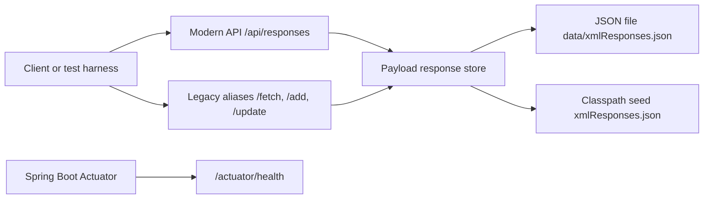
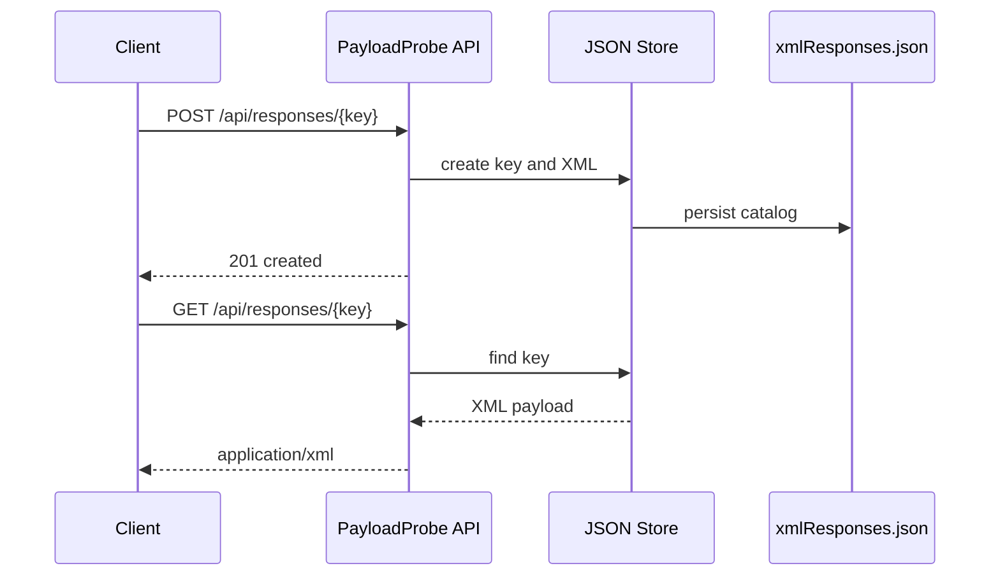
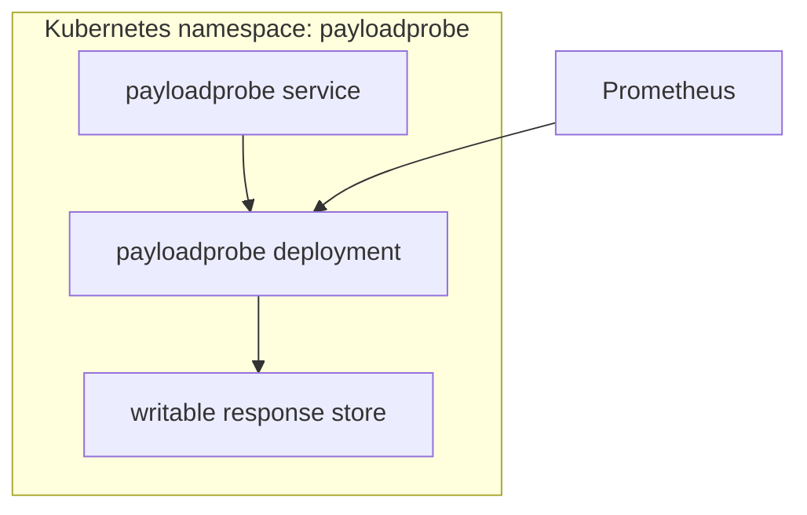

# Architecture

PayloadProbe Lab keeps the application intentionally small: one Spring Boot
service, one JSON-backed response catalog, and clear HTTP boundaries.

## Component View

## Request Flow

## Deployment Topology

## Design Direction

The first version focuses on a stable modernization foundation. Daily automation
can then add persistence options, richer validation, contract tests, dashboards,
security controls, and deployment polish in small verified steps.
