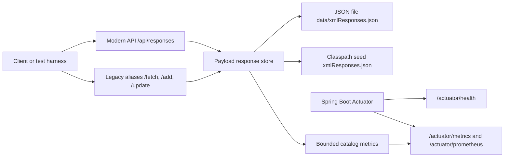
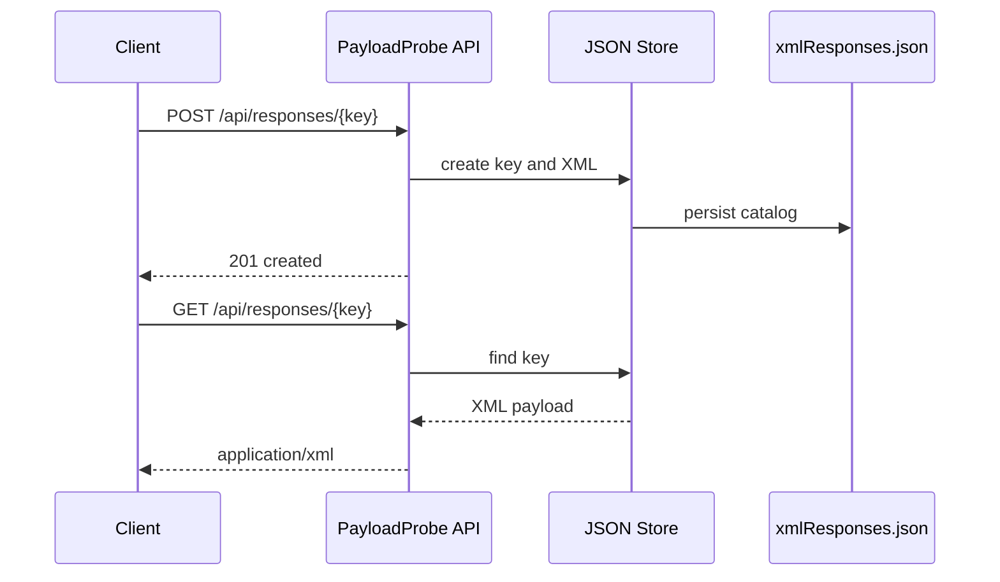
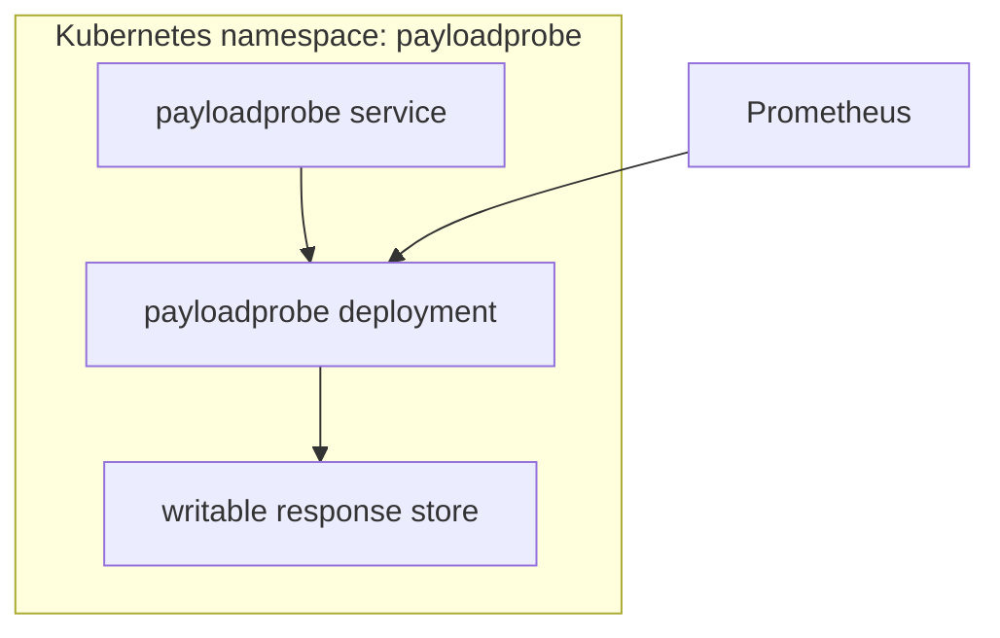

# Architecture

PayloadProbe Lab keeps the application intentionally small: one Spring Boot
service, one JSON-backed response catalog, and clear HTTP boundaries.

## Component View

```mermaid
flowchart LR
    Client["Client or test harness"] --> ModernApi["Modern API /api/responses"]
    Client --> LegacyApi["Legacy aliases /fetch, /add, /update"]
    ModernApi --> Store["Payload response store"]
    LegacyApi --> Store
    Store --> JsonFile["JSON file data/xmlResponses.json"]
    Store --> Seed["Classpath seed xmlResponses.json"]
    Spring["Spring Boot Actuator"] --> Health["/actuator/health"]
    Store --> Metrics["Bounded catalog metrics"]
    Spring --> MetricsApi["/actuator/metrics and /actuator/prometheus"]
    Metrics --> MetricsApi
```

## Request Flow

```mermaid
sequenceDiagram
    participant Client
    participant API as PayloadProbe API
    participant Store as JSON Store
    participant File as xmlResponses.json

    Client->>API: POST /api/responses/{key}
    API->>Store: create key and XML
    Store->>File: persist catalog
    API-->>Client: 201 created
    Client->>API: GET /api/responses/{key}
    API->>Store: find key
    Store-->>API: XML payload
    API-->>Client: application/xml
```

## Deployment Topology

```mermaid
flowchart TB
    subgraph Cluster["Kubernetes namespace: payloadprobe"]
        Service["payloadprobe service"]
        Pod["payloadprobe deployment"]
        Volume["writable response store"]
    end

    Service --> Pod
    Pod --> Volume
    Prometheus["Prometheus"] --> Pod
```

## Design Direction

The first version focuses on a stable modernization foundation. Store-level
metrics cover response lookups, misses, bounded write outcomes, and current
catalog size without recording keys or XML payloads. Daily automation can then
add persistence options, structured logging, dashboards, security controls, and
deployment polish in small verified steps.
